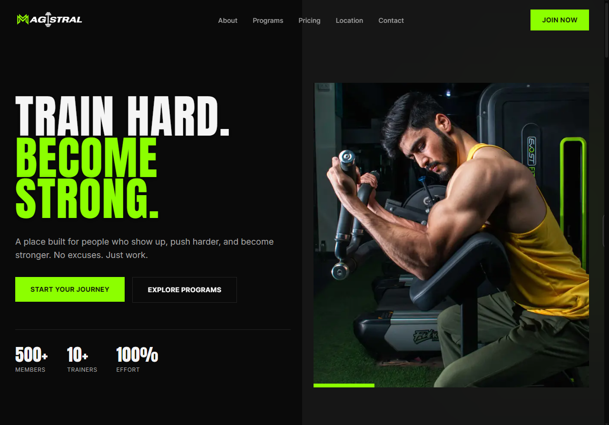

# Magistral Gym — Landing Page

A modern landing page concept designed for **Magistral Gym**, a local fitness business in Morocco.

The project was created as part of a real-world client outreach experience. The goal was to explore how a gym could present its brand, services, programs, pricing, location, and contact information in one clear online experience.

## Preview

## Live Demo

👉 [View Live Website](https://magistralegym.vercel.app/)

## About the Project

Magistral Gym primarily operates offline and through social media.

I designed a custom landing page around the gym's existing brand identity to demonstrate what a professional online presence could look like for the business.

The page was designed to make important information easy to find, including:

- Gym programs and services
- Membership pricing
- Opening hours
- Facilities and gallery
- Location
- Contact information
- Clear calls to action

## Business Goal

The concept focused on creating a simple path for a potential customer:

**Discover the gym → Understand the offer → Build trust → Contact the gym**

Rather than presenting scattered information across different platforms, the landing page brings the gym's essential information together in one place.

## Real-World Experience

This project became more than a design exercise.

I presented the concept directly to the gym owner and had a real conversation about the business, its customers, and whether a website would solve an important problem for them.

The project did not turn into a paid engagement, but the experience taught me an important business lesson:

> A good product is not enough on its own. It needs to solve a problem that the customer actually considers important.

That experience changed the way I think about client work. I now focus more on understanding the business and its needs before proposing a solution.

## What I Practiced

- Designing around an existing local brand
- Structuring a landing page around business information
- Creating clear calls to action
- Presenting a digital solution to a real business owner
- Listening to client objections and business priorities
- Understanding the importance of product–client fit

## Status

**Portfolio / Client Proposal Concept**

The concept was presented to the business owner but was not commissioned or launched as an official Magistral Gym website.

---

Designed and developed by **Ayoub Rachidi**